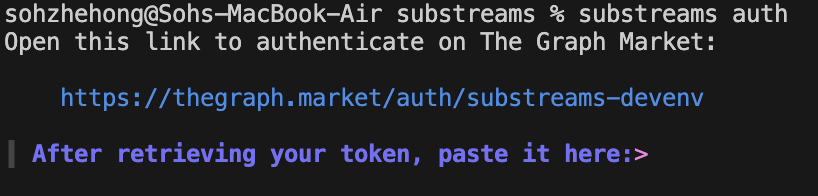
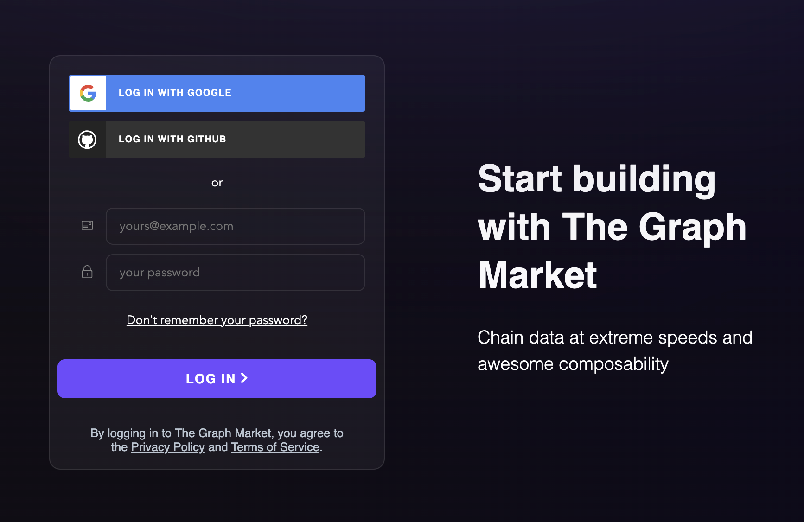
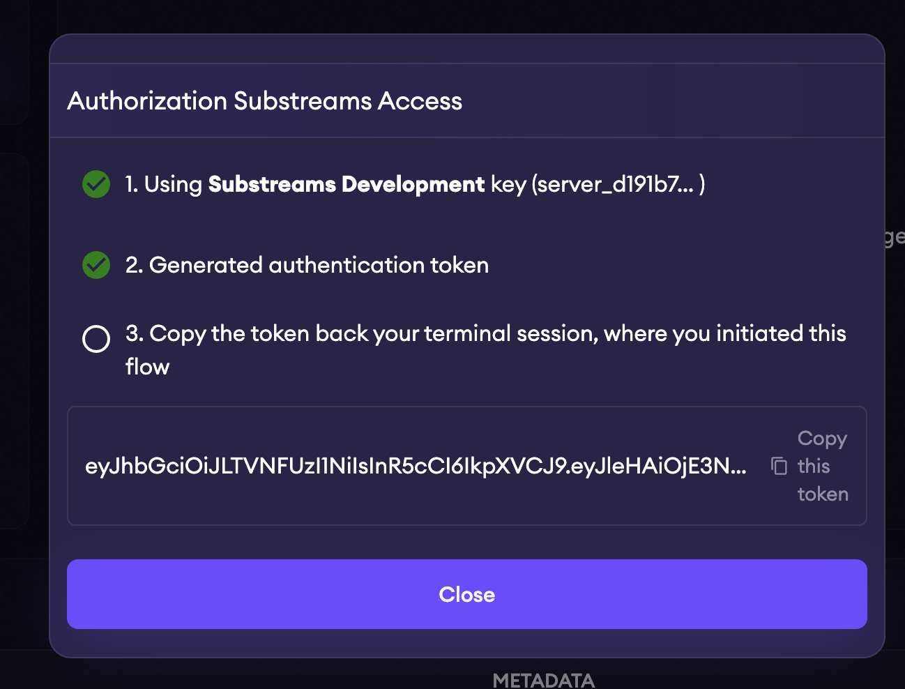
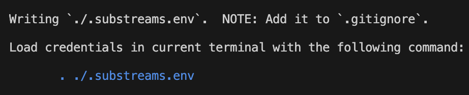
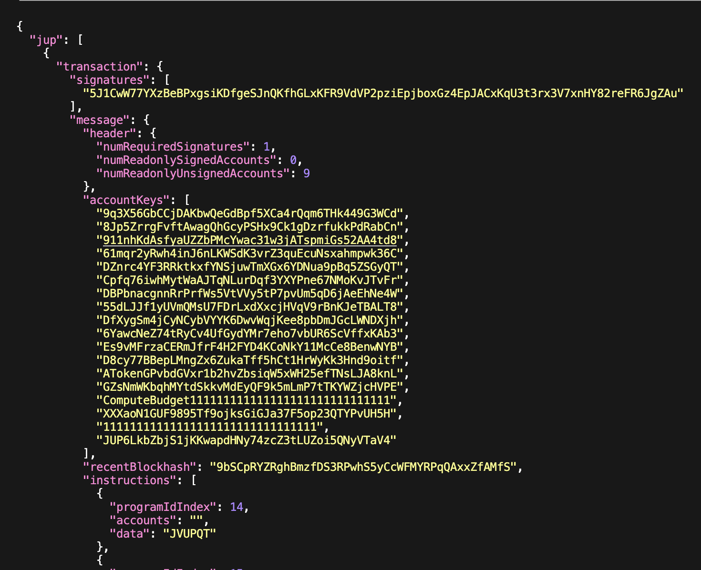

# Superteam Substreams Workshop

## Installing Dependencies

### Install the `subtreams` CLI

There are two options to start developing with substreams.

#### 1. Clone in local VSCode (Preferred)

- Install [Docker Desktop](https://www.docker.com/products/docker-desktop/)
- Install [VSCode](https://code.visualstudio.com/download)
- Install the [Devcontainer Extension](https://marketplace.visualstudio.com/items?itemName=ms-vscode-remote.remote-containers) in VSCode
- Open [this repository](https://github.com/streamingfast/substreams-starter), and execute "Rebuild & open in container"

#### Included in the dev environment

- `substreams` preinstalled
- For _Substreams_ development: **Rust** toolchain, `buf` and protobuf tooling,
- For _subgraph_ development: **node/npm**, along with all subgraph services, running in the devcontainer (`graph-node`, `postgres`, `ipfs`) directly accessible locally or remotely.
- Pre-configured VSCode extensions for everything, plus a custom _VSCode Substreams Extension_.

#### 2. Local install

- Install the `substreams` CLI, there are several options:

  - Homebrew Installation

  ```zsh
  brew install streamingfast/tap/substreams
  ```

  - Pre-compiled binary installation

    - MacOS:

    ```bash
        LINK=$(curl -s https://api.github.com/repos/streamingfast/substreams/releases/latest | awk "/download.url.*$(uname -s | tr '[:upper:]' '[:lower:]')\_$(uname -m)/ {print \$2}" | sed 's/"//g')
        curl -L $LINK | tar zxf -
    ```

    - Linux:

    ```bash
        LINK=$(curl -s https://api.github.com/repos/streamingfast/substreams/releases/latest | awk "/download.url.*linux_$(uname -m)/ {print \$2}" | sed 's/"//g')
        curl -L  $LINK  | tar zxf -
    ```

  - Installation from source

  ```bash
  git clone https://github.com/streamingfast/substreams
  cd substreams
  go install -v ./cmd/substreams

  ```

> [!IMPORTANT]
> Add `$HOME/go/bin` to the system path if it's not already present.

#### Validation of installation

Run the [`substreams` CLI](https://docs.substreams.dev/reference-material/substreams-cli/command-line-interface) passing the `--version` flag to check the success of the installation.

```bash
substreams --version
```

A successful installation will print the version that you have installed.

```bash
substreams version dev
```

### Developer Dependencies (Not Needed with Docker)

#### Rust Dependencies Installation

Developing Substreams modules requires a working [Rust](https://www.rust-lang.org/) compilation environment.

Install Rust through `curl` using:

```bash
curl --proto '=https' --tlsv1.2 -sSf https://sh.rustup.rs | sh
source $HOME/.cargo/env # to configure your current shell
```

**`wasm32-unknown-unknown` target**

Ensure you have the `wasm32-unknown-unknown` target installed on your Rust installation, if unsure, you can install it with:

```bash
rustup target add wasm32-unknown-unknown
```

#### Buf Installation

Buf simplifies the generation of typed structures in any language. Buf uses a remote builder executed on the Buf server, so an internet connection is required to generate Rust bindings from Protobuf definitions. To install the CLI, there are several options:

**1. Homebrew**

```zsh
brew install bufbuild/buf/buf
```

**2. NPM**

```bash
npm install @bufbuild/buf
```

To execute `buf` from the command line, you can use `npx`:

```bash
npx buf --version
```

**3. Windows**

You can install the Buf CLI using the [Scoop](https://scoop.sh/) installer for Windows:

```bash
scoop install buf
```

To update Buf:

```bash
scoop update buf
```

**Binary**

Buf offers Windows binaries for both the `x86_64` and `arm64` architectures. You can download the latest binaries from [GitHub Releases](https://github.com/bufbuild/buf/releases/latest).

## Substreams Integration With NextJS

### **1. Install Dependencies**

Make sure you have [Bun](https://bun.sh/) installed, then run:

```bash
bun install
```

### **2. Set Up Environment Variables**

- Rename your `.env.example` file to `.env`.
- Copy your **Substreams API Token** and update the file:

```bash
SUBSTREAMS_API_TOKEN=your_api_token_here
```

## Viewing Substreams Output

While following the steps below, any time you want to test your output, you can follow these steps to generate the necessary files, authenticate, and launch the Substreams GUI to view your results.

[!NOTE]

> After authentication, just run `substreams protogen`, `substreams build`, `substreams gui` commands in order to view your results

#### 1. Generate Protobuf Code

Before compiling the Rust code, run the following command to generate the Rust Protobuf definitions from the .proto files:

```bash
substreams protogen
```

#### 2. Build the Substreams Module

Next, compile the Rust code into a WebAssembly (.wasm) binary using:

```bash
substreams build
```

#### 3. Authenticate with StreamingFast

To interact with the Solana blockchain using Substreams, authenticate with StreamingFast:

```bash
substreams auth
```

You will get the following prompt:



Click on the link and you will be navigated to a page like this (If you don't have an account):



Register through whichever method you see fit. You will see the below page once done:



Copy the auth token and paste it into the CLI. Once done, you'll see the following output:



After authenticating, run `substreams gui` and press `Enter` to see your output.

### **3. Configure Substreams Constants**

Open the `constants.ts` file. This file contains all the necessary configuration variables for the Substreams integration.

```typescript
export const TOKEN: string = process.env.SUBSTREAMS_API_TOKEN || '';
export const ENDPOINT = 'https://mainnet.sol.streamingfast.io:443';
export const MODULE = 'your_module';
export const SPKG = 'your-spkg-file-v0.1.0.spkg';
export const START_BLOCK = 325320000;
export const STOP_BLOCK = '+100';
```

#### Explanation of constants

| Variable      | Description                                           |
| ------------- | ----------------------------------------------------- |
| `TOKEN`       | API Token (fetched from `.env`)                       |
| `ENDPOINT`    | Substreams endpoint for streaming blockchain data     |
| `MODULE`      | Name of the Substreams module to execute              |
| `SPKG`        | Name of the `.spkg` package file used for the stream  |
| `START_BLOCK` | The starting block number for processing              |
| `STOP_BLOCK`  | The number of blocks to process (relative stop block) |

### **4. Starting the Project**

Start the Next.js development server:

```bash
bun dev
```

Then, open `http://localhost:3000` in your browser to see the real-time blockchain data streaming.

## Tracking Token Transactions with Substreams on Solana

To begin using Substreams for tracking token transactions on Solana, we first set up a Substreams module that processes blockchain data efficiently. This involves:

### Step 1: Initialize a New Substreams Package

First, set up a new Substreams package using `substreams init` in the CLI with the below options:

1. Protocol - Select the **`Solana`** protocol
2. Type - Select **`sol-transactions`** to get filtered transactions only
3. Project Name - Any will do.
4. Initial Block - The starting block where you want to start indexing at. Any will do.
5. Transaction Filter - Remove the default option and paste the following below:

```bash
program:TokenkegQfeZyiNwAJbNbGKPFXCWuBvf9Ss623VQ5DA && (account:Es9vMFrzaCERmJfrF4H2FYD4KCoNkY11McCe8BenwNYB || account:JUPyiwrYJFskUPiHa7hkeR8VUtAeFoSYbKedZNsDvCN)
```

#### What This Filter Does

The filter ensures that Substreams processes only relevant transactions by applying the following conditions:

1. **`program:TokenkegQfeZyiNwAJbNbGKPFXCWuBvf9Ss623VQ5DA`**

- This specifies that we only care about transactions related to the Solana Token Program (SPL tokens).
- The Token Program is responsible for all standard token transfers on Solana.

2. **`(account:Es9vMFrzaCERmJfrF4H2FYD4KCoNkY11McCe8BenwNYB || account:JUPyiwrYJFskUPiHa7hkeR8VUtAeFoSYbKedZNsDvCN)`**

- This further narrows the scope to transactions involving specific tokens:
  - USDT (Es9vMFrzaCERmJfrF4H2FYD4KCoNkY11McCe8BenwNYB)
  - JUP (JUPyiwrYJFskUPiHa7hkeR8VUtAeFoSYbKedZNsDvCN)

This means that only transactions **where either of these tokens is transferred** will be processed.

### 2. Verifying Yaml File

If initialized correctly, you should be seeing something like this in the `substreams.yaml` file:

```yaml
modules:
  - name: map_filtered_transactions
    use: solana:transactions_by_programid_and_account_without_votes
    initialBlock: <YOUR-INITIAL-BLOCK>

  - name: map_my_data
    kind: map
    inputs:
      - map: map_filtered_transactions
    output:
      type: proto:mydata.v1.MyData

network: solana-mainnet-beta

params:
  map_filtered_transactions: program:TokenkegQfeZyiNwAJbNbGKPFXCWuBvf9Ss623VQ5DA && (account:Es9vMFrzaCERmJfrF4H2FYD4KCoNkY11McCe8BenwNYB || account:JUPyiwrYJFskUPiHa7hkeR8VUtAeFoSYbKedZNsDvCN)
```

You can also check out the complete file [here](./substreams-2/substreams.yaml) for comments on understanding what each configuration does.

[!IMPORTANT]

> When you're done verifying, please enter `substreams protogen` to generate the protobuf bindings.

### 3. Modifying Substreams Output

Before implementing the Rust logic, you need to modify the `mydata.proto` file located in the `proto/` folder. This file defines the structure of the data that your Substreams module will output.

1. Replace the contents of proto/mydata.proto with the following:

```proto
syntax = "proto3";

package mydata.v1;

import "sf/solana/type/v1/type.proto";

message MyData {
  repeated .sf.solana.type.v1.ConfirmedTransaction jup = 1;
  repeated .sf.solana.type.v1.ConfirmedTransaction usdt = 2;
}
```

2. When you're done, run `substreams protogen` to generate the protobuf bindings

#### What It Does

- `syntax = "proto3"`; → Specifies that this file uses Protocol Buffers v3.
- `package mydata.v1` → Defines the package namespace for this data structure.
- `import "sf/solana/type/v1/type.proto"` → Imports Solana’s predefined protobuf types, allowing us to use `ConfirmedTransaction`.
- `message MyData {}` → Defines a structured format for storing transactions.
  - `repeated .sf.solana.type.v1.ConfirmedTransaction jup = 1`
    - Stores all transactions involving the JUP token.
  - `repeated .sf.solana.type.v1.ConfirmedTransaction usdt = 2`
    - Stores all transactions involving the USDT token.

### 4. Implementing the Data Processing Logic

To extract and process JUP and USDT token transactions, modify lib.rs by adding the following code snippets. Each section explains what the code does.

#### 1. Import Required Modules

Add the necessary imports for working with Solana transactions and your protobuf definition

```rust
mod pb;
use pb::{mydata::v1 as mydata, sf::substreams::solana::v1::Transactions};
use pb::sf::solana::r#type::v1::{ConfirmedTransaction, InnerInstruction, InnerInstructions, Transaction};
```

This imports essential modules needed for handling transaction data.

#### 2. Define Token Addresses

Declare constants for the token addresses you want to track:

```rust
const JUP_TOKEN: &str = "JUPyiwrYJFskUPiHa7hkeR8VUtAeFoSYbKedZNsDvCN";
const USDT_TOKEN: &str = "Es9vMFrzaCERmJfrF4H2FYD4KCoNkY11McCe8BenwNYB";
```

This ensures that your code consistently refers to the correct token addresses.

#### 3. Map Transactions to Extract Relevant Data

Define a `map_my_data` function to filter and collect transactions involving JUP and USDT:

```rust
#[substreams::handlers::map]
fn map_my_data(transactions: Transactions) -> mydata::MyData {
    let mut my_data: mydata::MyData = mydata::MyData::default(); // Initialize MyData struct

    // Filter transactions that involve JUP token transfers
    my_data.jup = transactions
        .transactions
        .iter()
        .filter(|tx: &&ConfirmedTransaction| contains_transfer(*tx, JUP_TOKEN))
        .cloned()
        .collect();

    // Filter transactions that involve USDT token transfers
    my_data.usdt = transactions
        .transactions
        .iter()
        .filter(|tx: &&ConfirmedTransaction| contains_transfer(*tx, USDT_TOKEN))
        .cloned()
        .collect();

    my_data // Return the populated MyData struct
}
```

This function processes transactions, filters out those that involve JUP or USDT, and stores them in MyData.

#### 4. Check if a Transaction Contains a Token Transfer

Define a helper function that scans transactions to see if they involve a specific token:

```rust
fn contains_transfer(tx: &ConfirmedTransaction, token: &str) -> bool {
    let Some(meta) = &tx.meta else { return false };

    // Iterate over all inner instructions and check if any represent a token transfer
    meta.inner_instructions
        .iter()
        .flat_map(|i: &InnerInstructions| &i.instructions)
        .any(|instr: &InnerInstruction| is_token_transfer(instr, tx, token));

    return true; // This line should be fixed to return false if no transfer is found.
}
```

This function looks through a transaction’s metadata to determine if it includes a transfer of the specified token.

#### 5. Verify If an Instruction Represents a Token Transfer

Finally, define the logic that checks if a specific instruction involves the token:

```rust
fn is_token_transfer(instr: &InnerInstruction, tx: &ConfirmedTransaction, token: &str) -> bool {
    let Some(message) = tx.transaction.as_ref().and_then(|t: &Transaction| t.message.as_ref()) else {
        return false;
    };
    let token_bytes: &[u8] = token.as_bytes(); // Convert token address to bytes

    // Check if any account in the instruction matches the token address
    instr.accounts.iter().any(|&index| {
        message.account_keys.get(index as usize)
            .map(|key: &Vec<u8>| key == token_bytes)
            .unwrap_or(false)
    })
}
```

This function ensures that each instruction is checked against the token address to confirm if it’s a transfer.

#### 5. Testing the Output

Once you're done with modifying `lib.rs`, run `substreams build` and `substreams gui` to view your results.

The output should be similar to the following:



## Further Exploration

This [repository](http://github.com/streamingfast/substreams-sink-examples) contains several examples of production-ready sink applications to consume Substreams package.

The Go and JavaScript/TypeScript examples found below uses officially supported SDK(s) while Python and Rust examples are self-contained and you are expected to use the example as a base for your own sink, those examples are not re-usable libraries.

- [Go](https://github.com/streamingfast/substreams-sink-examples/blob/master/go/README.md)
- [JavaScript](https://github.com/streamingfast/substreams-sink-examples/blob/master/javascript/README.md)
  - [NodeJS](https://github.com/streamingfast/substreams-sink-examples/blob/master/javascript/node/README.md)
  - [Web](https://github.com/streamingfast/substreams-sink-examples/blob/master/javascript/web/README.md)
- [Python](https://github.com/streamingfast/substreams-sink-examples/blob/master/python/README.md)
- [Rust](https://github.com/streamingfast/substreams-sink-examples/blob/master/rust/README.md)
- [Substreams Subgraph Triggers](https://github.com/streamingfast/substreams-sink-examples/blob/master/subgraph-triggers/README.md)
